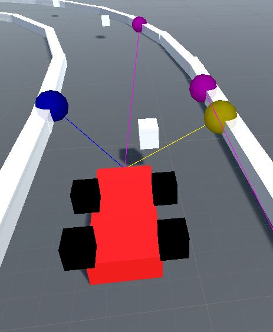

# Self Learning Driving Simulator

A Neural Network test to teach a car how to drive on a track. The Network uses genetic algorithm which is not the most time effecient way of training a neural network, but it is fun to see the progress. there is support for back propogation in this system but is not being used at the moment due to lack of training data

## Scene

## Car

### Inputs
The car is provided with 4 basic inputs
* Space on Left
* Space on Right
* Space in Front
* Current Speed

### Outputs
The input data is send to a neural network which then decides on either of outputs in each case
* Turn
  * Left
  * Right
* Speed
  * Accelerate
  * Decelerate

## Controlling The System
Use the game objects in scene to finely tune the system accrding to needs. 

## The System
when running press K to reset the cars, all cars are color coded
* Green - The best one from previous generation
* Yellow - Made by merging the best network and a random network
* Red - Made by merging 2 random networks

## Built with

* [Unity 3D](https://unity.com/) 

## Authors

* **Bhavil Gupta** - *Initial work* - [InFaNsO](https://github.com/InFaNsO)

## License

This project is licensed under the MIT License - see the [LICENSE.md](LICENSE.md) file for details
