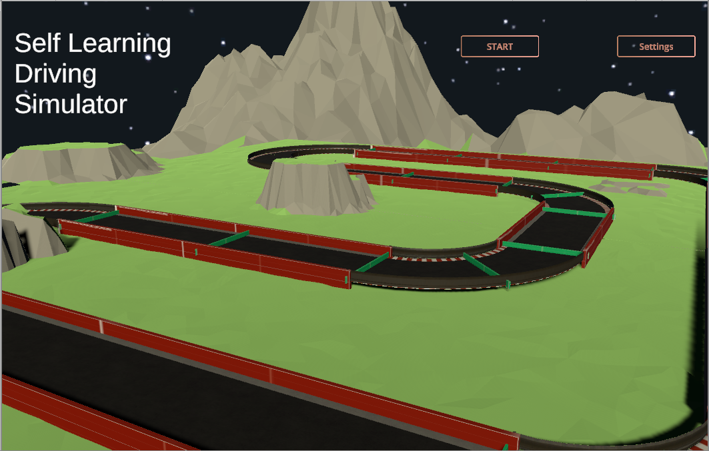

# Self Learning Driving Simulator

A Neural Network test to teach a car how to drive on a track. The Network uses genetic algorithm which is not the most time effecient way of training a neural network, but it is fun to see the progress. there is support for back propogation in this system but is not being used at the moment due to lack of training data

## User Interface
### Main Menue

* Let's user acesses the settengs 
* Let's user start the simulations

### Settings Menue

* Let's user set the number of instances in each generation
* Let's user set the number of hidden layers in the neural network
* Lets the user set the individual layers in the Neural network

### Simulation UI

* Let's user move to next generation
* Let's user save the best performing neural network

## Car

### Inputs
The car is provided with 4 basic inputs
* Space on Left
* Space on Right
* Space in Front
* Current Speed

### Outputs
The input data is send to a neural network which then decides on either of outputs in each case
* Turn
  * Left
  * Right
* Speed
  * Accelerate
  * Decelerate

## Built with

* [Unity 3D](https://unity.com/) 

## Authors

* **Bhavil Gupta** - *Initial work* - [InFaNsO](https://github.com/InFaNsO)

## License

This project is licensed under the MIT License - see the [LICENSE.md](LICENSE.md) file for details
